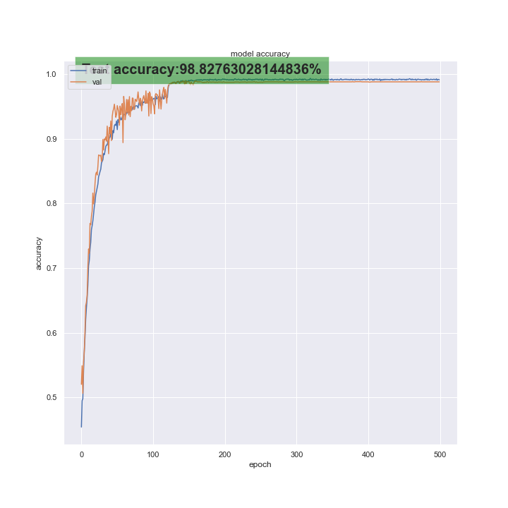

# handgesture_pose

Hand Gesture pose

Hand-pose-tracking-based gesture classififer.
Pose tracking tool: Google Mediapipe API
Deep Model Framework : Tensorflow 2

Classification models available:
* SVM Classifier 
* MLP Classifier 
* LSTM CLassifier (Best) 

## Setting up Repo and Dependecies

<ul>
    <li>Step 1: Clone the repository to local machine 
        <pre>git@github.com:bshreyas13/ASL-Captioning-v2.git</pre>
    </li>
</ul>

**Core Dependencies**: Python3 , Tensorflow2 , OpenCV, Google Mediapipe (python API), sklearn


# Dataset Information

If we dont have Raw_Dataset ( with keypoints extracted for all videos).Organize the data as follows; 
<pre>
../
 |__Data (Contains Videos)
 |__WORKDIR
 	|__Annotations
 		|__Annotations.xlsx     
</pre>

**Note**: Both Data and WORKDIR and one directory above git clone 

## Usage

Annotation example can be found im Annotation_example
First create a dataset of vectors from videos and annotation file.
```
python3 create_raw_dataset.py 
```
Accepted args:
```
"--data_dir", "-d", help="data directory ", default=f"{os.path.join(os.path.dirname(os.getcwd()),'Data')}" 
"--out_dir", "-o", help="output directory ", default=f"{os.path.join(os.path.dirname(os.getcwd()),'WORKDIR')}" 
"--annotation_filename", "-a_name", help="output filename ", default="Annotations.csv"
```
**Note**: If Annotations.xlsx/csv is not found in the right path the program will initialize a file with list of videos is Data. Expected path is "out_dir/Annotations/Annotations.xlsx/csv".

Ensure that you update the config file as needed here is an example used for training the best LSTM model:

<pre>
configs/
 |__LSTM_config.yaml
</pre>

**In file:**
<pre>
## Model Parameters
## Choose MODEL LSTM/MLP/SVM
MODEL: LSTM
## Choose MODE train/test/inference
MODE: inference
## Hyperparameters
## Layers, units, optimizer, epochs and batch_size
## These are required only for training/testing model
NUM_LAYERS: 1
NUM_UNITS: 100
OPTIMIZER: Adam
EPOCHS: 500
BATCH_SIZE: 25
## Used for building LSTM model with/ or without Conv1D Layer
INCLUDE_CONV_LAYER: True
## Mark SAVED _MODEL_PATH as None in case of training new model from scratch
SAVED_MODEL_PATH: ../WORKDIR/trained_models/best_model/GC_LSTM_500.h5
## Data parameters
## Resample window size and stride 
## If Training use any size of interest
## If Inference these should match params used while training saved model
WINDOW_SIZE: 1.5
STRIDE: 0.1
## Inference parameters
## Pass INPUT_MODE as path to video file to run inference on video file
INPUT_MODE: webcam
SAVE_VIDEO: False
PLAY_VIDEO: True
</pre>

```
python3 preprocess_train.py 
```

Accepted args:
```
"--config", "-c", help="path to configs directory.", default=f"{os.path.join(os.getcwd(),'configs')}"
"--data_dir", "-d", help="data directory ", default=f"{os.path.join(os.path.dirname(os.getcwd()),'WORKDIR','RAW_Dataset')}"
"--out_dir", "-o", help="output directory ", default=f"{os.path.join(os.path.dirname(os.getcwd()),'WORKDIR')}"  
```

## Model

Architeture of best LSTM-based model used for gesture calssifcation. This is the model used when code is run with above config settings.Schematic in progress.

<pre>

Model: "GC_LSTM"
_________________________________________________________________
 Layer (type)                Output Shape              Param #   
=================================================================
 input_10 (InputLayer)       [(None, 45, 63)]          0         
                                                                 
 conv1d_11 (Conv1D)          (None, 45, 32)            6080      
                                                                 
 dropout_22 (Dropout)        (None, 45, 32)            0         
                                                                 
 lstm_11 (LSTM)              (None, 100)               53200     
                                                                 
 dropout_23 (Dropout)        (None, 100)               0         
                                                                 
 dense_9 (Dense)             (None, 4)                 404       
                                                                 
=================================================================
Total params: 59,684
Trainable params: 59,684
Non-trainable params: 0
_________________________________________________________________

</pre>

## LSTM best results
This is as tested for a 4 class gesture classifcation problem
The training results obtained by running with the example configuration above are as shown:
<table style="padding: 10px">
    <tr>
        <td> </td>
    </tr>
<table>


## Roadmap
* Figure out Data management for hand sign 
* Hand pose tracking and keypoint extraction.
* Sample keypoints for every 15 frames and vectorize data.
* Use vectors to classify gesture.


## Authors and acknowledgment
**Author**:
* Name: Shreyas Bhat
* Email: bshreyas@vt.edu

**Maintainers**

* Name: Shreyas Bhat
* Email: bshreyas@vt.edu

* Name: Sarang Joshi
* Email: 

## Project status
SVM, MLP and LSTM code and training complete. Inference on Video and WEbcam added. Testing in progress.
