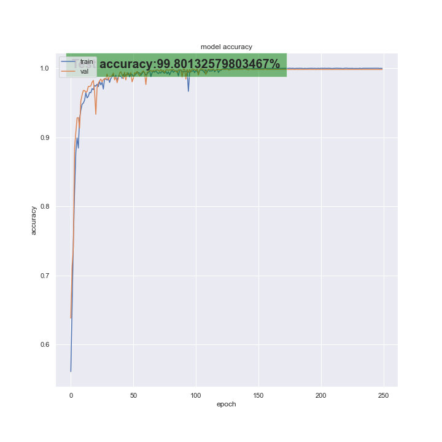

# ASL Captioning V2

ASL captioning using Hand Gesture recognition from pose

Hand-pose-tracking-based gesture classififer.
Pose tracking tool: Google Mediapipe API
Deep Model Framework : Tensorflow 2

Classification models:
* LSTM + Conv1D

## Setting up Repo and Dependecies

<ul>
    <li>Step 1: Clone the repository to local machine 
        <pre>git@github.com:bshreyas13/ASL-Captioning-v2.git</pre>
    </li>
</ul>

**Core Dependencies**: Python3 , Tensorflow2 , OpenCV, Google Mediapipe (python API), sklearn.

**Note**: requirements.txt in dev

# Dataset Information

If we dont have Raw_Dataset ( with keypoints extracted for all videos).Organize the data as follows; 
<pre>
../
 |__Data (Contains Videos)
 |__WORKDIR
 	|__Annotations
 		|__Annotations.xlsx     
</pre>

**Note**: Both Data and WORKDIR and one directory above git clone 

## Usage

### Step 0 : Setup

**NOTE TO CONTIRIBUTORS**: The annotations and parsing methods will need to be updated according to datasets used.

Annotation example used for custom dataset used for developignt hsi codebase can be found im Annotation_example

**Note**: If Annotations.xlsx/csv is not found in the right path the program will initialize a file with list of videos is Data. Expected path is "out_dir/Annotations/Annotations.xlsx/csv".

Ensure that you update the config file as needed here is an example used for training the best LSTM model:
<pre>
configs/
 |__LSTM_config.yaml
</pre>

**In file:**
<pre>
## Raw landmarks extraction params
## Classes list 
CLASSES: ['Stop','Go','Change_Lane', 'None']
## Pose machine paramters
## If only body pose is true includes torso 4, arms 2 each and 3 kp for hands
## If both body and high resolution hand torso 4, arms 2 and 21 kp for hands
BODY_POSE: True
HIGH_RES_HANDS: True

## Data parameters
## Resample window size and stride 
## If Training use any size of interest
## If Inference these should match params used while training saved model
WINDOW_SIZE: 1.5
STRIDE: 0.1

## Model Parameters
## Choose MODEL LSTM/MLP/SVM
MODEL: LSTM
## Choose MODE train/test/inference
MODE: inference 
## Hyperparameters
## Layers, units, optimizer, epochs and batch_size
## These are required only for training/testing model
NUM_LAYERS: 1
NUM_UNITS: 100
OPTIMIZER: Adam
EPOCHS: 250
BATCH_SIZE: 25
## Used for building LSTM model with/ or without Conv1D Layer
INCLUDE_CONV_LAYER: True

## Mark SAVED _MODEL_PATH as None in case of training new model from scratch
SAVED_MODEL_PATH: ../WORKDIR/trained_models/best_model/GC_LSTM_250.h5

## Save parameters for tracked videos
SAVE_VIDEO: True
PLAY_VIDEO: False

## Inference only parameters can be set as None if MODE != inference
## Pass INPUT_MODE as path to video file to run inference on video file
## For camera use 'webcam'
INPUT_MODE: ../Data/2022-09-09 10-52-23.mp4
</pre>

If you do not have trained model. start from step 1, else skip to step 3 for inference.

### Step 1: Create Raw Keypoint Dataset from videos.
```
python3 create_raw_dataset.py 
```
Accepted args:
```
"--data_dir", "-d", help="data directory ", default=f"{os.path.join(os.path.dirname(os.getcwd()),'Data')}" 
"--out_dir", "-o", help="output directory ", default=f"{os.path.join(os.path.dirname(os.getcwd()),'WORKDIR')}" 
"--annotation_filename", "-a_name", help="output filename ", default="Annotations.csv"
```

### Step 2: Preprocess Raw Keypoint Dataset to prepare data for training.
```
python3 preprocess_train.py 
```

Accepted args:
```
"--config", "-c", help="path to configs directory.", default=f"{os.path.join(os.getcwd(),'configs')}"
"--data_dir", "-d", help="data directory ", default=f"{os.path.join(os.path.dirname(os.getcwd()),'WORKDIR','RAW_Dataset')}"
"--out_dir", "-o", help="output directory ", default=f"{os.path.join(os.path.dirname(os.getcwd()),'WORKDIR')}"  
```
### Step 3: Inference Mode

```
python3 preprocess_train.py 
```
## Classifier Model

Architeture of best LSTM-based model used for gesture calssifcation. This is the model used when code is run with above config settings.Schematic in progress.

<pre>

Model: "GC_LSTM"
_________________________________________________________________
 Layer (type)                Output Shape              Param #   
=================================================================
 input_1 (InputLayer)        [(None, 45, 81)]          0         
                                                                 
 conv1d (Conv1D)             (None, 45, 32)            7808      
                                                                 
 dropout (Dropout)           (None, 45, 32)            0         
                                                                 
 lstm (LSTM)                 (None, 100)               53200     
                                                                 
 dropout_1 (Dropout)         (None, 100)               0         
                                                                 
 dense (Dense)               (None, 4)                 404       
                                                                 
=================================================================
Total params: 61,412
Trainable params: 61,412
Non-trainable params: 0
_________________________________________________________________

</pre>

## LSTM best results

The training results obtained by running with the example configuration above are as shown:
<table style="padding: 10px">
    <tr>
        <td> </td>
    </tr>
<table>


## Roadmap
* Hand pose tracking and keypoint extraction.
* Sample keypoints for every 15 frames and vectorize data.
* Use vectors to classify gesture.
* Trained and tested SVM for classification with best results at 34% test accuracy
* Trained and Tested MLP Classififer , best results is at 53% test accuracy
* LSTM Classifier trained and best model with 99.8% prediction accuracy on test set obtained.
* Inference Pipeline complete for video and webcam.
* Current data sampling params ( 1.5s windows with 0.1s stride) result in slow switch between actions.
* Next step is to tune for speed without reducing accuracy. 

## Authors and acknowledgment

**Author**:
* Name: Shreyas Bhat
* Email: sbhat@vtti.vt.edu

**Maintainers**

* Name: Cody Crofford
* Email: 

* Name: Sarang Joshi
* Email: 

* Name: Shreyas Bhat
* Email: 

## Project status
SVM, MLP and LSTM code and training complete. Inference on Video and WEbcam added. Testing in progress.
